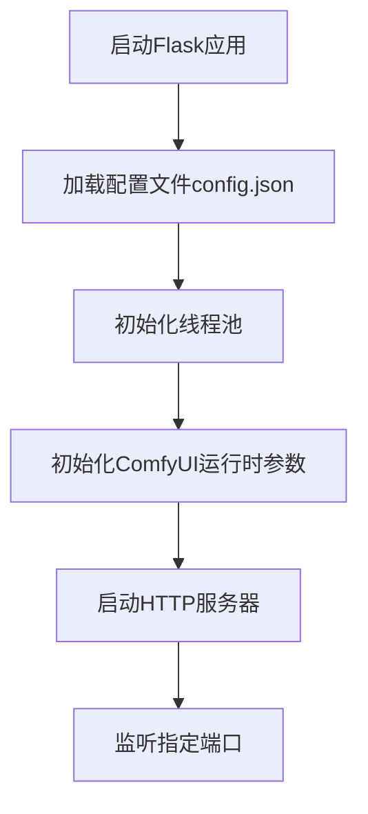
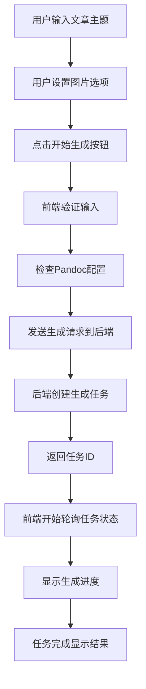
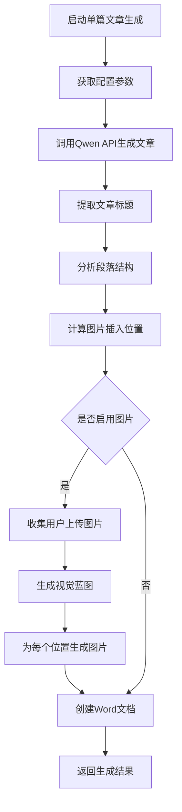
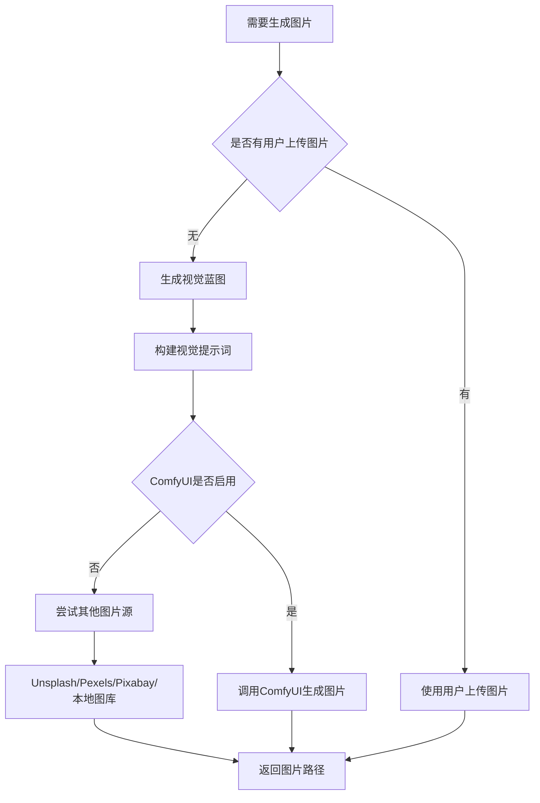
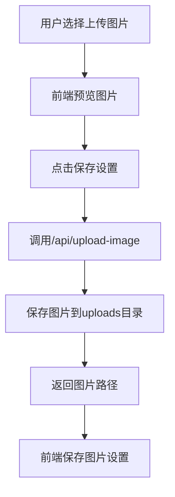
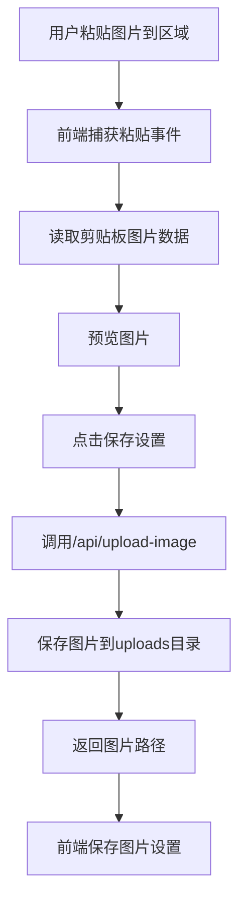
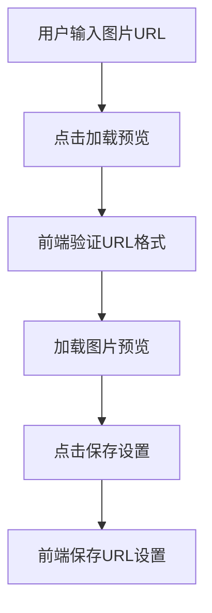
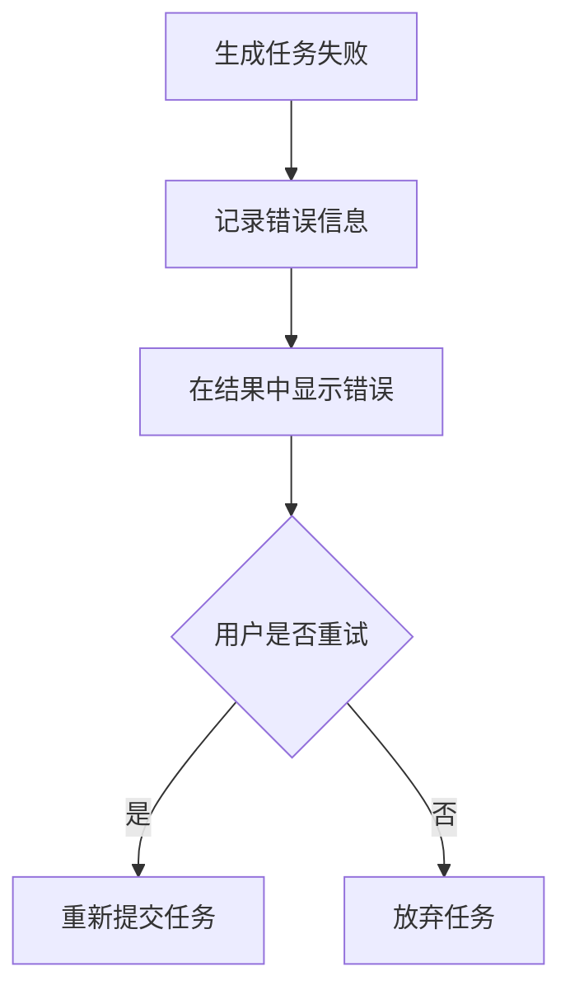

# 张飞吃豆芽项目业务流程文档

## 1. 项目概述

"张飞吃豆芽"是一个基于Flask的AI文章生成器，主要功能包括：
- 使用阿里云Qwen模型生成文章
- 自动为文章配图（支持多种图片源）
- 生成Word文档格式的输出
- 支持批量文章生成和并发处理

## 2. 整体架构

项目采用前后端分离的架构：
- 后端：Python Flask框架
- 前端：HTML + CSS + JavaScript
- 数据存储：JSON配置文件和文件系统

### 2.1 核心组件

1. **后端API服务器** (`app.py`) - 提供RESTful API接口
2. **前端页面** (`templates/`) - 包含写作、配置、历史记录三个页面
3. **前端交互逻辑** (`static/*.js`) - 处理用户交互和API调用
4. **配置管理** - 通过`config.json`文件存储用户配置

## 3. 详细业务流程

### 3.1 系统启动流程



**涉及方法：**
- `load_config()` - 加载配置文件
- `create_executor()` - 创建线程池
- `update_comfyui_runtime()` - 更新ComfyUI运行时参数
- `find_available_port()` - 查找可用端口

### 3.2 用户访问流程

#### 3.2.1 访问写作页面

```mermaid
graph TD
    A[用户访问 /] --> B[Flask路由 index()]
    B --> C[渲染 templates/write.html]
    C --> D[加载 static/write.js]
    D --> E[恢复页面状态]
    E --> F[检查Pandoc配置]
    F --> G[显示写作界面]
```

**涉及方法：**
- `@app.route('/')` → `index()` - 返回写作页面
- `restorePageState()` - 恢复页面状态
- `check_pandoc()` - 检查Pandoc配置

#### 3.2.2 访问配置页面

```mermaid
graph TD
    A[用户访问 /config] --> B[Flask路由 config_page()]
    B --> C[渲染 templates/config.html]
    C --> D[加载 static/config.js]
    D --> E[加载配置数据]
    E --> F[显示配置界面]
```

**涉及方法：**
- `@app.route('/config')` → `config_page()` - 返回配置页面
- `loadConfig()` - 加载配置数据
- `loadModels()` - 加载模型列表

#### 3.2.3 访问历史记录页面

```mermaid
graph TD
    A[用户访问 /history] --> B[Flask路由 history_page()]
    B --> C[渲染 templates/history.html]
    C --> D[加载 static/history.js]
    D --> E[加载历史记录]
    E --> F[显示历史记录]
```

**涉及方法：**
- `@app.route('/history')` → `history_page()` - 返回历史记录页面
- `loadHistory()` - 加载历史记录
- `@app.route('/api/history')` → `get_history()` - 获取历史记录API

### 3.3 文章生成主流程

#### 3.3.1 用户操作流程



**涉及前端方法：**
- `getAllTopics()` - 获取所有主题
- `generateBtn.addEventListener()` - 生成按钮事件处理
- `pollStatus()` - 轮询任务状态
- `updateUI()` - 更新界面显示

**涉及后端方法：**
- `@app.route('/api/generate')` → `generate_article()` - 启动生成任务
- `_execute_generation_task()` - 执行生成任务
- `_execute_single_article_generation()` - 执行单个文章生成
- `@app.route('/api/generate/status/<task_id>')` → `get_generation_status()` - 获取生成状态

#### 3.3.2 后端文章生成详细流程



**涉及方法：**
1. `generate_article_with_qwen()` - 使用Qwen API生成文章
2. `extract_article_title()` - 提取文章标题
3. `extract_paragraph_structures()` - 提取段落结构
4. `compute_image_slots()` - 计算图片插入位置
5. `resolve_image_with_priority()` - 根据优先级获取图片
6. `create_word_document()` - 创建Word文档
7. `inject_images_into_markdown()` - 将图片插入到Markdown中

#### 3.3.3 图片生成流程



**涉及方法：**
- `generate_visual_blueprint_qwen()` - 生成视觉蓝图
- `build_visual_prompts()` - 构建视觉提示词
- `resolve_image_with_priority()` - 按优先级获取图片
- `generate_image_with_comfyui()` - 调用ComfyUI生成图片
- `download_unsplash_image()` - 从Unsplash下载图片
- `download_pexels_image()` - 从Pexels下载图片
- `download_pixabay_image()` - 从Pixabay下载图片
- `get_local_image_by_tags()` - 从本地图库获取图片

### 3.4 配置管理流程

#### 3.4.1 加载配置

```mermaid
graph TD
    A[页面加载] --> B[调用/api/config GET]
    B --> C[load_config()读取config.json]
    C --> D[返回配置数据]
    D --> E[前端填充表单]
```

**涉及方法：**
- `@app.route('/api/config', methods=['GET'])` → `handle_config()` - 获取配置
- `load_config()` - 加载配置文件

#### 3.4.2 保存配置

```mermaid
graph TD
    A[用户点击保存配置] --> B[收集表单数据]
    B --> C[调用/api/config POST]
    C --> D[合并新旧配置]
    D --> E[save_config()保存到config.json]
    E --> F[更新线程池]
    F --> G[更新ComfyUI运行时]
    G --> H[返回保存成功]
```

**涉及方法：**
- `@app.route('/api/config', methods=['POST'])` → `handle_config()` - 保存配置
- `save_config()` - 保存配置文件
- `create_executor()` - 更新线程池
- `update_comfyui_runtime()` - 更新ComfyUI运行时参数

### 3.5 图片处理流程

#### 3.5.1 用户上传图片



**涉及方法：**
- `@app.route('/api/upload-image')` → `upload_image()` - 上传图片
- `saveImageBtn.addEventListener()` - 保存图片按钮事件

#### 3.5.2 粘贴图片



**涉及方法：**
- `pasteZone.addEventListener('paste')` - 粘贴事件处理
- `@app.route('/api/upload-image')` → `upload_image()` - 上传图片

#### 3.5.3 URL图片



**涉及方法：**
- `loadUrlBtn.addEventListener()` - 加载URL按钮事件

## 4. 核心功能模块

### 4.1 模型管理模块

**功能：** 管理可用的阿里云Qwen模型

**涉及方法：**
- `@app.route('/api/models')` → `get_qwen_models()` - 获取模型列表
- `@app.route('/api/test-model')` → `test_qwen_model()` - 测试模型

**当前支持模型：**
- qwen-plus
- qwen-plus-2025-09-11
- qwen-max
- qwen3-max
- qwen-turbo
- qwen-long

### 4.2 并发处理模块

**功能：** 支持多篇文章同时生成

**涉及方法：**
- `ThreadPoolExecutor` - 线程池
- `_execute_generation_task()` - 执行生成任务
- `create_executor()` - 创建线程池

### 4.3 图片源管理模块

**功能：** 支持多种图片源，按优先级获取图片

**图片源优先级（默认）：**
1. ComfyUI自动生成
2. 用户上传
3. Pexels
4. Unsplash
5. Pixabay
6. 本地图库

**涉及方法：**
- `resolve_image_with_priority()` - 按优先级获取图片
- `get_image_with_priority()` - 获取图片

### 4.4 文档生成模块

**功能：** 将Markdown格式文章转换为Word文档

**涉及方法：**
- `create_word_document()` - 创建Word文档
- `inject_images_into_markdown()` - 将图片插入到Markdown中

## 5. 错误处理机制

### 5.1 任务失败处理



**涉及方法：**
- `@app.route('/api/generate/retry')` → `retry_failed_topics()` - 重试失败主题

### 5.2 API错误处理

所有API调用都有完善的错误处理机制，包括：
- 网络超时
- API密钥错误
- 模型不存在
- 配额不足等

## 6. 数据持久化

### 6.1 配置文件

- `config.json` - 存储用户配置
- `config.example.json` - 配置示例文件

### 6.2 输出文件

- `output/` - 生成的Word文档
- `uploads/` - 用户上传的图片
- `pic/` - 本地图库

## 7. 安全机制

### 7.1 文件上传安全

- 文件类型检查（仅允许图片格式）
- 文件名安全处理（使用secure_filename）
- 文件大小限制

### 7.2 API安全

- API密钥保护
- 请求频率限制提示
- 错误信息过滤

## 8. 性能优化

### 8.1 并发处理

使用线程池支持多篇文章同时生成，提高处理效率。

### 8.2 缓存机制

- 模型列表缓存
- 图片下载缓存

### 8.3 异步处理

- 任务状态轮询
- 后台任务执行